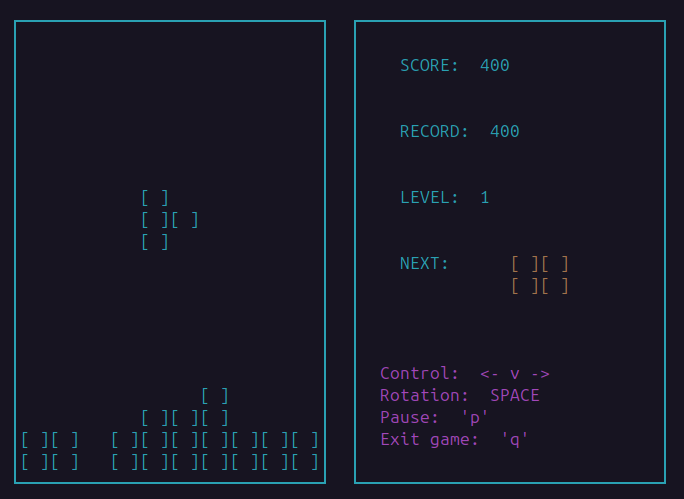
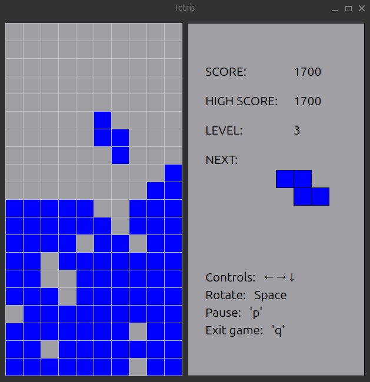
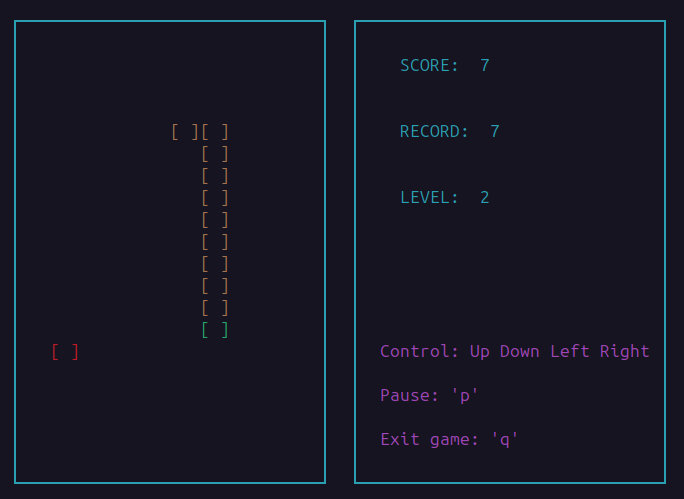
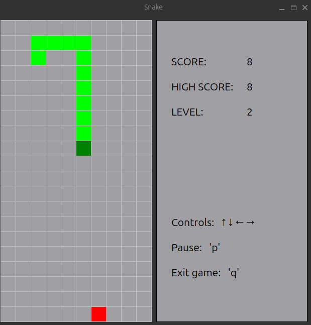

# BrickGame v2.0 (Tetris + Snake) 

**BrickGame v2.0** is a comprehensive gaming project that brings together two classic arcade games - Tetris and Snake. The project showcases different implementation approaches, with Tetris developed in C using terminal interface and Snake built with C++20 and Qt GUI framework.

### Dual Implementation Architecture

The project is structured into two distinct implementations:

#### 🧱 Tetris (C Implementation)
- **Language**: C11 standard
- **Interface**: Terminal-based using `ncurses` library
- **Architecture**: Finite State Machine (FSM)
- **Build System**: GNU Makefile

#### 🐍 Snake (C++ Implementation)  
- **Language**: Modern C++20
- **Interface**: Desktop GUI using Qt6 framework
- **Architecture**: Model-View-Controller (MVC) pattern
- **Build System**: qmake

## Requirements
- `gcc` compiler
- `C++20 Compatible Compiler` (GCC 10+, Clang 10+, MSVC 2019+)
- `ncurses` library (for the terminal interface)
- `Qt 6.0+` GUI framework
- `qmake` build system
- `Make` utilit
- `check` library (for Tetris unit tests)
- `gtest` library (for Snake unit tests)
- OS: Windows 10+, macOS 10.14+, or Linux (Ubuntu 18.04+)

## 🎯 Game Features

### Tetris Features
- All 7 classic tetromino shapes
- Bidirectional figure rotation
- Hard drop - instant figure placement
- Next figure preview
- Multiple line clears simultaneously
- Progressive difficulty levels

#### Tetris Scoring System
- Points are awarded for clearing lines:
  - 1 line: 100 points.
  - 2 lines: 300 points.
  - 3 lines: 700 points.
  - 4 lines: 1500 points.
- The high score is saved between game sessions

#### Tetris Level Progression
- New level every 600 points
- Speed increases with each level
- Maximum level: 10

### Snake Features
- Apple collection and growth mechanics
- Collision detection (walls and self)
- Progressive difficulty with increasing speed

#### Snake  Scoring System
- Apple collection: +1 points per apple
- The high score is saved between game sessions

#### Snake Level Progression
- New level every 10 points
- Speed increases with each level
- Maximum level: 10

## Installation And Running the Game
- Clone the repository on your computer.
- Navigate to the `src/` directory.
- Build the project: `make all` or `make install`.
- Play console version: `make run_cli`
- Play desktop version: `make run_desktop`

## Testing
- To run unit tests:`make test`
- To generate a test coverage report: `make gcov_report`
